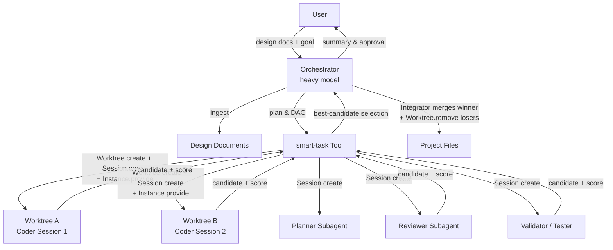

# 02-autocrew-system-architecture.md

**AutoCrew Mode – System Architecture**
**Document Version:** 1.3
**Date:** April 21, 2026
**Author:** Jim
**Status:** Draft – for implementation by Claude Code / future AutoCrew

## 1. Purpose

This document defines the technical architecture for AutoCrew Mode. It explains how the new feature integrates into OpenCode's existing codebase without requiring major refactoring, leveraging the already mature session management, Task tool, command registry, and `Worktree` service infrastructure.

The architecture is deliberately minimal: we add one new primary agent mode, extend the Task tool with a "smart" orchestration layer, and wire it into the existing `Worktree` service. Everything else (UI visibility, background execution, permissions, command loading) is reused from current OpenCode primitives.

## 2. High-Level Architecture

AutoCrew follows a **hierarchical multi-agent crew** pattern:

- **Orchestrator** (primary agent)
  - Uses a heavy model (provider-agnostic; v0 defaults to a free `zen` model).
  - Responsible for high-level reasoning, planning, iteration, coordination, best-candidate arbitration, and final integration.
  - Never writes code directly.

- **Role-based Subagents** (hidden or visible child sessions)
  - Specialized agents (Planner, Coder, Reviewer, Validator, Tester, Integrator, etc.).
  - Each runs with its own model, system prompt, and tool permissions.
  - Fast agents are used for execution-heavy roles.
  - Parallel workers for the same task each run inside their own git worktree for isolation.

- **Smart-Task Engine**
  - The single new core component that sits between the Orchestrator and the subagents.
  - Handles task DAG scheduling, worktree provisioning, parallel child-session spawning, result collection, candidate scoring, and best-candidate selection.

All subagents run as **child sessions** of the main Orchestrator session. This guarantees:
- Full visibility in both CLI TUI and web UI via OpenCode's existing session navigation.
- Automatic parent/child tracking via the existing session schema (`parentID` on `Session.Info`).
- Persistent state that survives OpenCode restarts.

## 3. Core Components

| Component              | Type                  | Model Recommendation (v0 default) | Responsibility                                      | New Code Required? |
|------------------------|-----------------------|-----------------------------------|-----------------------------------------------------|--------------------|
| Orchestrator           | Primary Agent         | `zen/big-pickle` (free)           | Planning, coordination, arbitration & integration   | Persona + system prompt (Doc 08) |
| Planner                | Subagent              | `zen/big-pickle` (free)           | Detailed task breakdown & plan iteration            | Role definition (Doc 04) |
| Coder                  | Subagent (parallel)   | `zen/big-pickle` (free)           | Pure code generation/editing                        | Role definition (Doc 04) |
| Reviewer / Validator / Tester / Integrator | Subagent | `zen/big-pickle` (free)         | Quality gates, testing, merging                     | Role definition (Doc 04) |
| smart-task tool        | Extended Tool         | N/A                               | Task DAG, worktree fan-out, candidate selection     | Yes (main addition — Doc 05) |
| ingest-design-docs tool| Helper Tool           | N/A                               | Parse design document folder                        | Small (Doc 05 §6) |

In v1, each role's `model` is expected to be tuned per provider (e.g. a reasoning model for Planner/Reviewer, a fast model for Coder). v0 deliberately uses the same free model everywhere to exercise the plumbing at zero cost.

## 4. Data Flow

1. **Ingestion**
   User provides design docs folder → `ingest-design-docs` tool extracts requirements, constraints, and architecture into structured context stored in the orchestrator's run-ledger.

2. **Planning Phase**
   Orchestrator (heavy model) generates/refines implementation plan (multiple internal iterations possible, capped by `plan-iteration-rounds`).

3. **Task Breakdown & Dispatch**
   Orchestrator outputs a structured list of micro-tasks with optional `depends_on` edges (a DAG). Canonical DAG schema is in Doc 08 §3.
   `smart-task` tool automatically:
   - Topologically schedules tasks.
   - For each parallel group within a rank: provisions worktrees via `Worktree.create({ name })`, creates child sessions via `Session.create({ parentID })`, and binds each worker's tool execution to its worktree via `Instance.provide({ directory: wt.directory, fn })`. (Path resolution is driven by `Instance.directory`, not by `workspaceID` — see §5.)
   - Assigns tasks (load-balanced or duplicated across worktrees for candidate generation).
   - In v0, emits one `SubtaskPart` per worker so the existing `runLoop` drains them serially (isolation preserved via worktrees; wall-clock execution sequential). v1 upgrades to concurrent `ops.prompt` without changing the orchestrator interface (see Doc 05 §4).

4. **Execution & Candidate Selection**
   Subagents complete their work → results are returned to the smart-task engine, each with an associated worktree/branch for parallel Coders.
   Reviewer/Validator/Tester roles score each candidate (real signals: tests, lint, review score).
   The Orchestrator (or Integrator role) selects the winning candidate. Losing worktrees are removed via `Worktree.remove({ directory })`.

5. **Integration & Review**
   Winning changes are merged into the primary workspace (Integrator role), the Orchestrator runs final validation, and presents a single summary to the user.

6. **Failure Handling**
   On task failure the smart-task engine applies the retry/replan/review state machine (see Doc 05 §7 and Doc 07 §3). The orchestrator meta-evaluates whether to continue or move tasks to the backlog.

7. **Loop / Completion**
   If further work is needed, the Orchestrator loops back to step 3. Otherwise it finishes.

## 5. Integration with Existing OpenCode Primitives

- **Child Sessions** — Fully reused. AutoCrew only adds automatic spawning and orchestration. The correct API is `Session.create({ parentID, title?, permission? })`; parent/child relationships are queryable via `Session.children(parentID)`. There is no separate "background runner" abstraction — sessions are asynchronous by default.
- **Autonomous Orchestrator Loop — `SubtaskPart` + `runLoop` + synthetic-user-continuation.** AutoCrew does **not** invent a new loop mechanism; it rides on the primitive opencode already ships:
  - `SubtaskPart` is a first-class, durable message-stream entry (`packages/opencode/src/session/message-v2.ts:217-232`) describing `{agent, prompt, description, model, command}`.
  - `runLoop` (`packages/opencode/src/session/prompt.ts:1305`) is a `while(true)` driven by pending parts. It scans backward for `CompactionPart | SubtaskPart` entries (lines 1322-1331) and drains them before yielding back to the LLM.
  - When a subtask completes, `handleSubtask` (`prompt.ts:525-716`) records the result and, if the orchestrator needs to continue, **injects a synthetic user message** (`prompt.ts:699-715`) — literally "Summarize the task tool output above and continue with your task." — that forces another LLM iteration without a real user turn. This is exactly the "loop without user input" mechanism AutoCrew needs.
  - The loop terminates naturally when the orchestrator emits a normal text response with no tool calls and no pending parts (exit condition at `prompt.ts:1345-1353`).
  - AutoCrew's contribution is: (a) an orchestrator agent persona that emits `SubtaskPart`s via the `smart-task` tool; (b) a `max-rounds-per-run` cap to prevent runaway dispatch (a documented failure mode of hierarchical CrewAI-style managers); (c) a structured run ledger for provenance; (d) best-candidate selection logic.
- **Worker-to-Worktree Binding — `Instance.provide({ directory })`.** The mechanical wiring for pointing a worker session at a worktree is **not** `workspaceID` (which is metadata only). Tools like `read`/`write`/`bash` resolve paths via `Instance.directory` (set in the Effect context by `Instance.provide`). The correct pattern for `smart-task` per worker is:
  1. `const wt = yield* Worktree.create({ name })` — provisions isolated directory + branch.
  2. `const child = yield* Session.create({ parentID })` — creates the child session record.
  3. Wrap the worker's execution in `Instance.provide({ directory: wt.directory, init, fn })` so its tool calls resolve paths inside the worktree.
  4. On cleanup: **dispose the session before calling `Worktree.remove`** — sessions are not auto-terminated when a worktree is removed, and tests (`packages/opencode/test/project/worktree.test.ts:139-141`) show `Instance.dispose()` precedes `remove()`.
- **Task Tool** — Extended (not replaced) into `smart-task`. Backward compatible. The existing `task` tool already spawns child sessions and constrains their permissions; `smart-task` adds DAG scheduling, worktree binding, and candidate selection on top.
- **Worktree Service** — Fully reused via `@opencode/Worktree` (see `packages/opencode/src/worktree/index.ts`). AutoCrew calls `Worktree.create({ name })` to provision isolated branches for parallel Coders, and `Worktree.remove({ directory })` to clean up losing candidates. Each worktree lives at `{Global.Path.data}/worktree/{projectID}/{name}` on branch `opencode/{name}`.
- **Plan Durability — `session.plan()`.** Opencode sessions have a durable plan slot (`packages/opencode/src/session/session.ts:255`). The orchestrator writes the initial plan here at round 0 so it survives context compaction on long runs — the orchestrator can always reload the plan to stay on mission even if its immediate context is trimmed.
- **Session Navigation** — No changes required. Existing CLI TUI and web UI navigation expose parent/child sessions; users can inspect any live sub-session.
- **Permission System** — Subagents do **not** automatically inherit full parent permissions. The existing `task` tool explicitly **denies** tools the subagent is not authorized for, producing a least-privilege child session. AutoCrew keeps this deny-down model and can further restrict per-role in config.
- **Orchestrator Run-Ledger (replaces "shared memory")** — AutoCrew does **not** pollute every worker session with the full run history. Instead, the orchestrator maintains a run-scoped ledger at `.opencode/autocrew-state/{run_id}/`:
  - `ledger.json` – one entry per spawned task: role, assigned worker session id, worktree branch, input context files, output summary, candidate score, merge decision.
  - `design-docs.md` – concatenated ingested design docs.
  - `plan.json` – current plan with iteration history.
  - Each worker session receives only a narrow, task-scoped injection (task description + relevant files + role prompt), not the entire ledger. Workers stay lean; the orchestrator owns the run history.
- **Command Registry** — Slash commands (`/autocrew`, `/pause-autocrew`, etc.) are registered via the existing command loader in `packages/opencode/src/command/index.ts`. No new registry.
- **Web UI & CLI TUI** — Zero frontend changes. All new behavior happens server-side.

## 6. Simple Architecture Diagram (Mermaid)

## 7. New Internal Components (minimal)

1. `SmartTaskTool` class (extends existing TaskTool) — task DAG scheduler + worktree provisioning + `Instance.provide` binding + candidate selection. Emits `SubtaskPart`s for workers and collects their results into the ledger.
2. Orchestrator agent persona (a markdown agent file under `.opencode/agent/` or `packages/opencode/src/agent/`) — its system prompt implements the plan → dispatch → collect → arbitrate → integrate → (loop or finish) discipline. The loop mechanism itself is the existing `runLoop`; the prompt is what makes the orchestrator behave as an orchestrator. See Doc 08 for the prompt.
3. `AutoCrewLedger` — append-only JSON ledger owned by the orchestrator (see §5 above).
4. Configuration parser for the new `autocrew` section in `opencode.json`.
5. Role registry for easy addition of new roles.
6. Slash command markdown files in `.opencode/command/` for `/autocrew`, `/pause-autocrew`, etc.

No changes are required to session management, UI layers, core provider code, or the turn loop itself.
